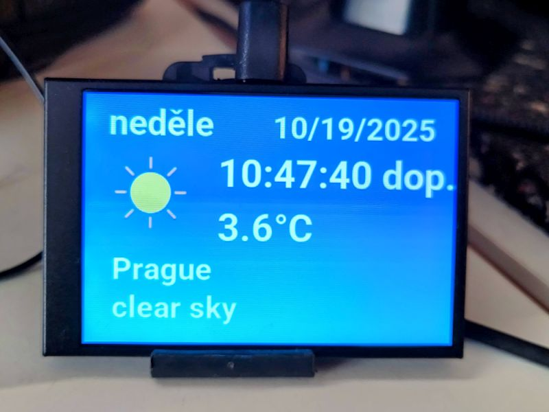

# Weather App Smart Screen

### ⚠️ DISCLAIMER

This project is **a community fork inspired by the Turing Smart Screen project**. It is **not affiliated, associated, authorized, endorsed by, or in any way officially connected with the Turing brand**, or any of its subsidiaries, affiliates, manufacturers, or sellers of Turing products.
All names and trademarks belong to their respective owners.

***

## Overview

This project is a **Python-based weather display application** for the **Turing Smart Screen hardware**, using data fetched from a **weather API**.
It retains compatibility with the Turing Smart Screen architecture while replacing system monitoring features with real-time weather displays.

You can use this as a **standalone weather dashboard** or embed it as part of larger projects that use the screen as a micro display.

The original codebase and display hardware interface come from the open-source [turing-smart-screen-python](https://github.com/mathoudebine/turing-smart-screen-python) project, adapted here for weather visualization and simpler operation.

 

***

## Features

- Displays live weather data from a configurable weather API.
- Customizable refresh interval and display brightness through `config.yaml`.
- Supports all display revisions: **A**, **B**, **flagship**, and **simulation (SIMU)** mode.
- Fully cross-platform: works on **Windows**, **Linux**, **macOS**, and **Raspberry Pi**.
- Auto-detects COM port connection (“AUTO” mode).
- Easy configuration – no modifications to source code are required.
- Compatible with **3.5" 320×480 IPS USB-C (UART)** touch display.

***

## Installation

1. Clone or download this repository:

```bash
git clone git@github.com:koss822/turing-weather-app.git
cd turing-weather-app
```

2. Install the dependencies:

```bash
pip install -r requirements.txt
```

3. Configure your settings in `config.yaml`:

```yaml
screen_brightness: 50
api_key: "your-weather-api-key"
hr24: true
degc: true
d_weather: 5
COM_PORT: "AUTO"
REVISION: "A"
```


***

## Usage

To start the app, simply run:

```bash
python weather-app.pyw
```

The screen will initialize automatically, connect to the weather API, and begin updating weather information at the configured interval.

If you do not have a connected display, use **SIMU mode** (set `REVISION: "SIMU"`) to simulate the output on a local image file (`screencap.png`).

***

## Configuration

All application settings are centralized in `config.yaml`.
You can adjust:

- **screen_brightness** — display brightness (1–100)
- **api_key** — your weather API key
- **hr24** — use 24-hour format (true/false)
- **degc** — use Celsius units (true) or Fahrenheit (false)
- **d_weather** — update interval in minutes
- **COM_PORT** — serial port name or `"AUTO"`
- **REVISION** — hardware revision ("A", "B", "SIMU", or "flagship")

***

## Screenshot Examples

*(Optional: Add your screenshots here)*

Example simulated screen output:
`res/example-weather-display.png`

***

## Credits

This project is a **fork** of the open-source [turing-smart-screen-python](https://github.com/mathoudebine/turing-smart-screen-python) by **mathoudebine**, modified to display weather data using modern weather APIs.

